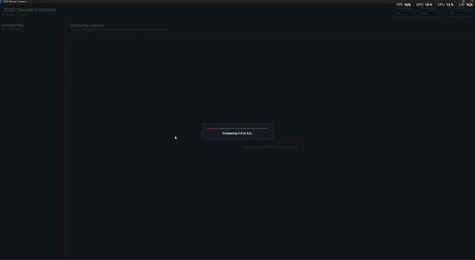

# 7D2D Version Compare

Desktop tool for comparing 7 Days to Die XML files between game versions and spotting mod conflicts caused by those changes.



## What It Does

- Compares XML files between two local 7 Days to Die version folders.
- Lists changed XML files by added, removed, and modified status.
- Shows a side-by-side style diff with added and removed lines highlighted.
- Opens each file at the first changed area and lets you jump between changed areas.
- Optionally compares a mod folder against the changed game files to flag likely conflicts.
- Caches generated version diffs locally so repeated comparisons are faster.

## Install

Download the latest Windows release from the GitHub Releases page and extract the zip anywhere you want to keep the tool.

The extracted folder should contain:

```text
VersionCompareTool.exe
Versions/
Mods/
```

Run `VersionCompareTool.exe` to open the app.

## Add Game Versions

The app does not include 7 Days to Die files. Add your own XML snapshots under the `Versions` folder, using one folder per game version.

```text
Versions/
  2.6/
    Data/
      Config/
        items.xml
        blocks.xml
  3.0/
    Data/
      Config/
        items.xml
        blocks.xml
```

Every direct child folder under `Versions` appears in the Start Version and End Version dropdowns. After you pick a start version, that same version is removed from the end version dropdown so the app always compares two different folders.

## Add Mods

Mod comparison is optional and off by default. To compare a mod, add it under the `Mods` folder:

```text
Mods/
  BetterAxes/
    Config/
      items.xml
```

Every direct child folder under `Mods` appears in the Mod Compare dropdown. When you select a mod, the app checks whether any mod XML files map to XML files changed between the selected game versions.

Paths are compared case-insensitively. A leading `Data/` segment is ignored, so these paths can match:

```text
Data/Config/items.xml
Config/items.xml
```

## Use The App

1. Put at least two game version folders under `Versions`.
2. Open `VersionCompareTool.exe`.
3. Select a Start Version and End Version.
4. Select a changed file from the left panel.
5. Review the diff on the right.
6. Use the up and down controls above the diff to jump between changed areas.
7. Select a Mod Compare value only when you want to scan for mod conflicts.

Large version folders can take several minutes to scan the first time. Later comparisons of the same unchanged folders should be faster because the diff is cached locally.

## Local Diff Cache

Generated version diffs are cached on your machine at:

```text
%LOCALAPPDATA%/7D2D-Version-Compare/DiffCache
```

The cache is refreshed automatically when either selected version folder changes. The app checks XML file paths, file counts, total bytes, latest write time, and file metadata before reusing a cached diff.

Changing the selected mod does not refresh the base version diff cache. Mod conflict checks run after the version diff is loaded.

## Troubleshooting

If no versions appear, make sure your folder layout looks like:

```text
Versions/<version name>/**/*.xml
```

If a mod does not appear, make sure your folder layout looks like:

```text
Mods/<mod name>/**/*.xml
```

If a comparison looks stale after manually editing files, restart the app or delete the local diff cache folder. The app should normally detect changed XML metadata and refresh automatically.

## Contributing

Developer setup, build commands, and release details are in [CONTRIBUTORS.md](CONTRIBUTORS.md).
